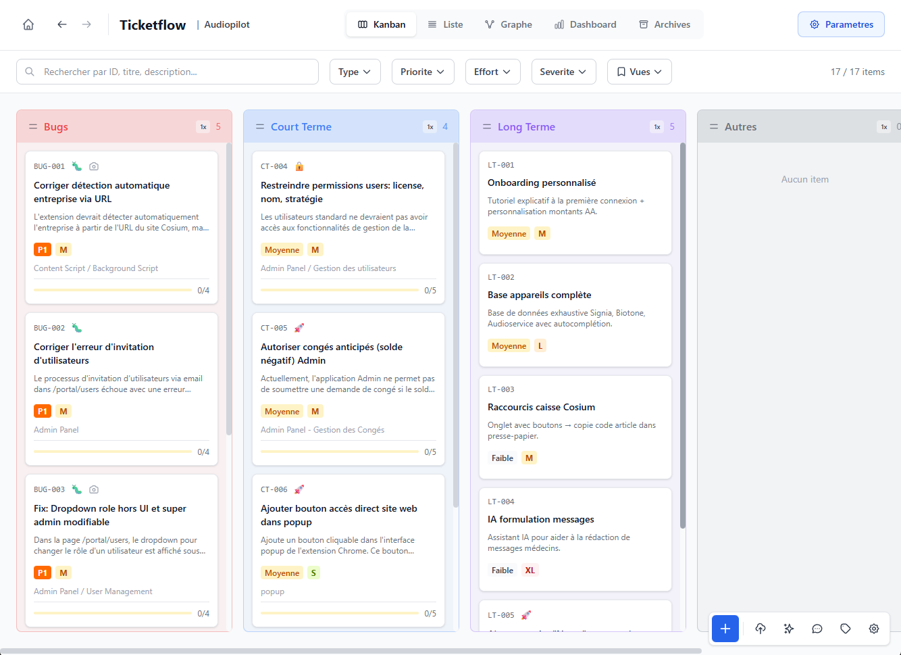
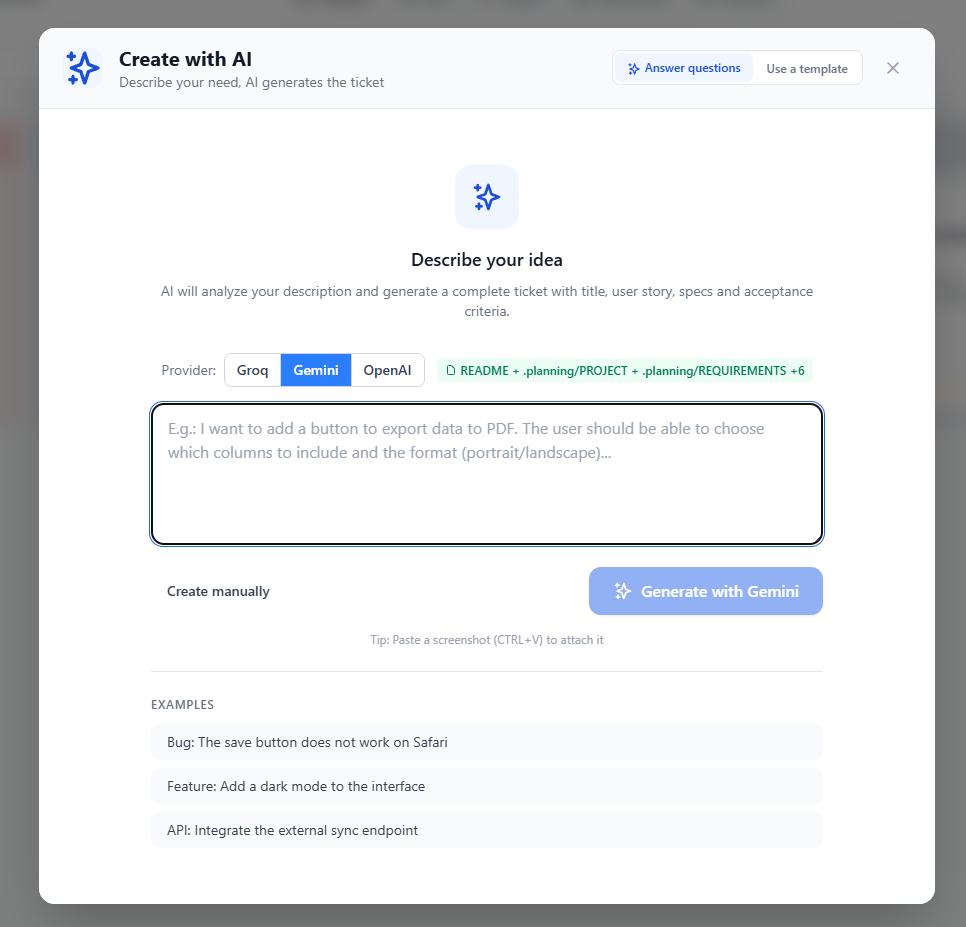
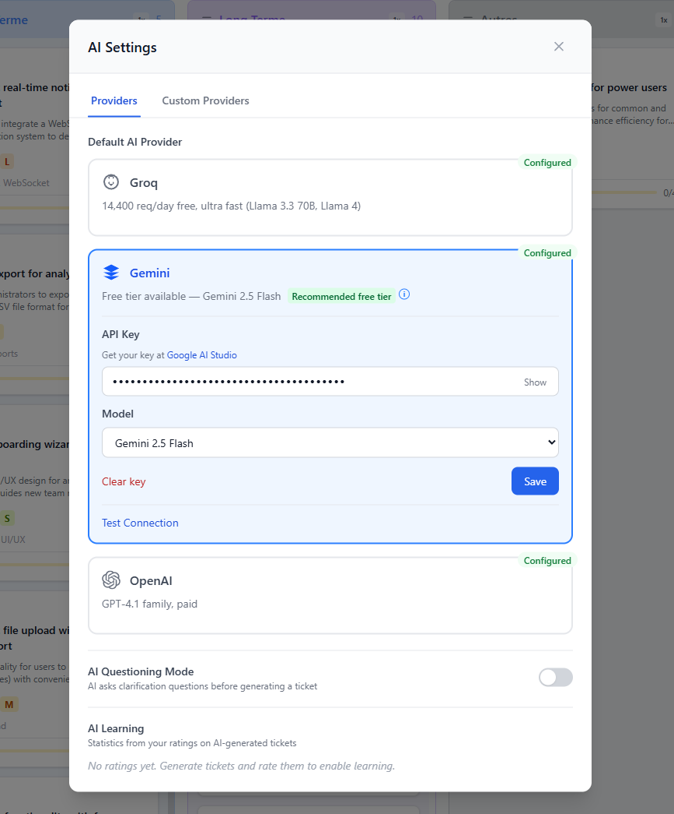
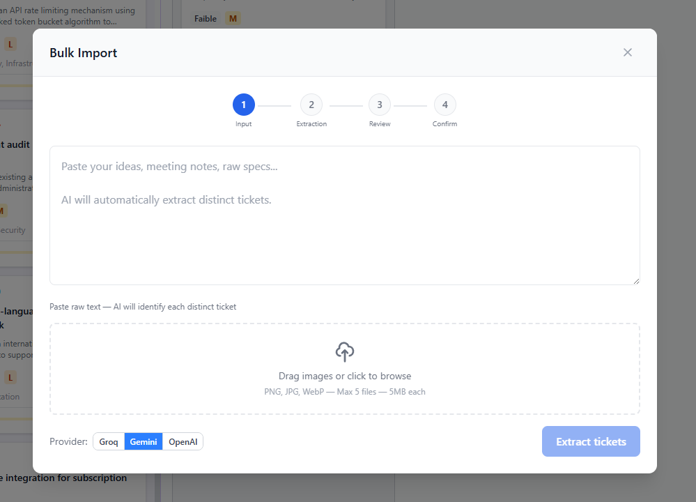
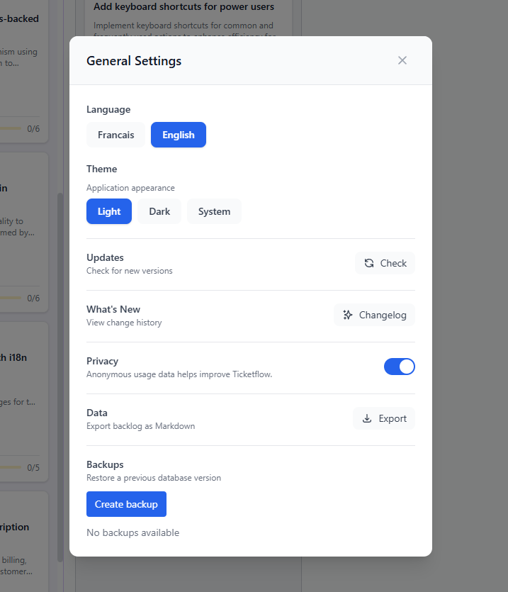
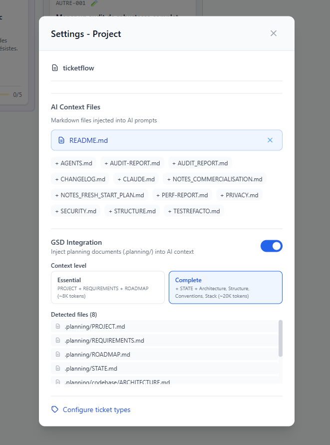
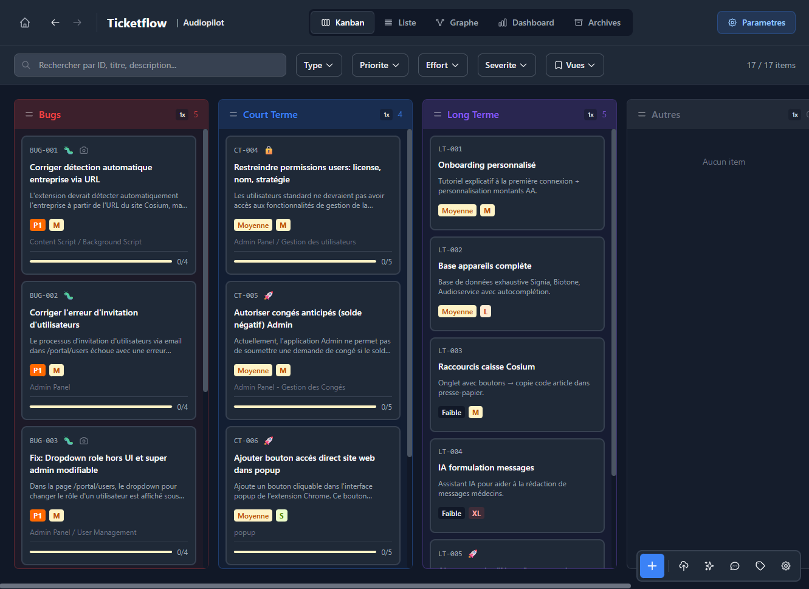

<div align="center">

# TicketFlow

A local-first desktop app that turns your chaotic brain dumps into organized, AI-powered tickets — ready to feed to your coding CLI.

**Stop scattering your ideas across .txt files, Discord messages, and mental post-its.**


[](https://github.com/gsd-build/get-shit-done)

<br>



</div>

---

## Why TicketFlow?

Before TicketFlow, my workflow looked like this:

```
ideas.txt           -> "faudra que je fix ca"
Discord messages    -> "j'avais pense a un truc..."
Mental post-its     -> forgotten by tomorrow
Random notes        -> scattered everywhere
```

Now it looks like this:

```
Brain dump -> TicketFlow -> Organized ticket -> Feed to AI CLI
```

One place. Every idea captured, organized, contextualized with your project, and ready to hand off to Cursor, Claude Code, or whatever AI tool you use.

**Built for vibecoders** — solo developers who use AI to ship fast and need a clean way to organize what to build next.

## Features

### Core
- **Kanban board** — Drag & drop your tickets across columns
- **List view** — Sortable table with all fields
- **Custom types** — Bug, Feature, API, Short-term, Long-term — define your own
- **SQLite storage** — One `.db` file per project, fast and portable
- **Multi-project** — Switch between projects with favorites

### AI-Powered
- **AI ticket generation** — Describe your idea in plain language, get a full ticket (title, description, user story, acceptance criteria)
- **AI bulk import** — Paste raw text or drop an image, AI extracts multiple tickets at once via a 4-step wizard
- **AI refinement** — Improve any ticket with a custom prompt
- **AI chat panel** (Ctrl+J) — Ask questions about your backlog, get proactive suggestions
- **Screenshot vision** — Paste a screenshot, AI analyzes it (Gemini/OpenAI)
- **3 providers** — Groq (free), Google Gemini, OpenAI — bring your own API key
- **Custom providers** — Add any OpenAI-compatible endpoint (Ollama, LM Studio, etc.)
- **Provider health check** — Verify your API key and connection before generating
- **Locale-aware** — AI generates tickets in your language (FR/EN)

### Power User
- **Command palette** (Ctrl+K) — Fuzzy search across tickets, commands, and views
- **Inline editing** — Double-click any field to edit in place
- **Bulk operations** — Multi-select (Ctrl+Click, Shift+Click) with floating action bar
- **20+ keyboard shortcuts** — Navigate and act without touching the mouse
- **Full-text search** — FTS5-powered instant search across all fields
- **Quick capture** (Ctrl+Alt+T) — Global shortcut to capture an idea without switching windows

### Polish
- **Dark mode** — Semantic theme tokens, toggle with one click
- **Animations** — Framer Motion transitions on cards, panels, and modals
- **i18n** — Fully bilingual French and English (UI + AI prompts)
- **Onboarding** — 7-step wizard with AI setup and guided tour
- **Analytics dashboard** — See your backlog health at a glance
- **Saved views** — Persist custom filters for quick access
- **Telemetry** — Optional anonymous usage analytics with full GDPR consent (off by default)

### Desktop
- **Native Windows app** — Tauri 2 (Rust backend), no Electron bloat
- **Local-first** — Your data stays on your machine. No cloud, no account. Optional anonymous telemetry (off by default, see [Privacy Policy](PRIVACY.md)).
- **Auto-update** — Get notified when a new version is available
- **System tray** — Minimize to tray

## See it in action

### AI Ticket Generation
> Describe your idea, click generate — AI fills in every field.


### Bulk Import
> Paste raw text, AI structures it into tickets — confirm and import.


### Drag & Drop Kanban
> Move tickets between columns with smooth drag-and-drop.


## Installation

### Download (Recommended)

Grab the latest installer from [Releases](https://github.com/Bouaris/ticketflow/releases):
- `Ticketflow_x.x.x_x64-setup.exe` (NSIS installer)
- `Ticketflow_x.x.x_x64_en-US.msi` (MSI installer)

### Build from Source

```bash
# Prerequisites: Node.js 18+, pnpm, Rust
git clone https://github.com/Bouaris/ticketflow.git
cd ticketflow
pnpm install

# Development
pnpm dev          # Web dev server (localhost:5173)
pnpm tauri dev    # Desktop app in dev mode

# Production build
pnpm build        # Web build
pnpm tauri build  # Windows .exe
```

## Breaking Changes in v2.0.0

**Auto-update from v1.x is NOT supported.**

Due to a security requirement (signing key rotation), users on v1.6.0 or earlier cannot auto-update to v2.0.0. To upgrade:

1. Download the v2.0.0 installer from [Releases](https://github.com/Bouaris/ticketflow/releases/latest)
2. Run the installer (it will replace the old version)

Future updates (v2.0.0 and later) will auto-update normally.

## What's New in v2.2.1

- **Stress-tested at 1000+ tickets** — CRUD, bulk import, FTS5 search, and concurrency validated
- **Full codebase audit** — 44 findings identified, classified, and all resolved
- **Architecture refactored** — ai.ts split into 6 modules, ProjectWorkspace into 5 hooks
- **Performance optimized** — React.memo on KanbanCard, ListView virtualization
- **Security hardened** — SHA-pinned CI, dependencies updated to latest, Tauri 2.10.x
- **README showcase** — Hero screenshot, workflow GIFs, 3x2 gallery

## Quick Start

1. **Create a project** — Give it a name, pick a folder
2. **Set up AI** — The onboarding wizard guides you, or go to Settings > paste your API key (Groq is free: [console.groq.com/keys](https://console.groq.com/keys))
3. **Create a ticket** — Click "+", describe your idea, let AI do the rest
4. **Bulk import** — Paste meeting notes or a list of ideas, AI extracts all tickets at once
5. **Organize** — Drag tickets on the Kanban, set priorities, group by type
6. **Ship** — Export tickets to feed your AI coding tool

## Tech Stack

| Layer | Technology |
|-------|-----------|
| Frontend | React 19, TypeScript 5.9 |
| Styling | Tailwind CSS 4 |
| Build | Vite 7 |
| Desktop | Tauri 2 (Rust) |
| Database | SQLite (tauri-plugin-sql) |
| Search | FTS5 full-text search |
| AI | Groq, Gemini, OpenAI |
| Animations | Framer Motion |
| Validation | Zod 4 |
| Drag & Drop | dnd-kit |
| Testing | Vitest 4, 490+ tests |

## Project Structure

```
ticketflow/
├── src/
│   ├── components/
│   │   ├── ui/            # Reusable primitives (Modal, Badge, Icons...)
│   │   ├── workspace/     # Main workspace + project management
│   │   ├── editor/        # Ticket creation/editing modal
│   │   ├── kanban/        # Kanban board with virtualized columns
│   │   ├── list/          # List view with sorting
│   │   ├── detail/        # Detail panel
│   │   ├── palette/       # Command palette (Ctrl+K)
│   │   ├── chat/          # AI chat panel
│   │   ├── import/        # Bulk import wizard
│   │   ├── filter/        # Filter bar + saved views
│   │   ├── settings/      # Settings modal
│   │   ├── welcome/       # Welcome page + project launcher
│   │   └── analytics/     # Dashboard charts
│   ├── hooks/             # Custom React hooks
│   ├── lib/               # Core logic (AI, search, commands)
│   ├── db/                # SQLite migrations & transactions
│   ├── i18n/              # Internationalization (FR/EN)
│   ├── types/             # TypeScript types & Zod schemas
│   └── constants/         # Config, shortcuts, storage keys
├── src-tauri/             # Rust backend (Tauri 2)
└── public/                # Static assets
```

## Built with GSD

TicketFlow's development is powered by [GSD (Get Shit Done)](https://github.com/gsd-build/get-shit-done) — a framework for shipping software with AI. GSD's `.planning/` project files (roadmap, phases, requirements) feed directly into TicketFlow's AI ticket generation, giving maximum project-aware context for every generated ticket.

## Gallery

<table>
  <tr>
    <td align="center">
      
      <br><em>AI Ticket Creation</em>
    </td>
    <td align="center">
      
      <br><em>AI Settings</em>
    </td>
  </tr>
  <tr>
    <td align="center">
      
      <br><em>Bulk Import Wizard</em>
    </td>
    <td align="center">
      
      <br><em>General Settings</em>
    </td>
  </tr>
  <tr>
    <td align="center">
      
      <br><em>GSD Integration</em>
    </td>
    <td align="center">
      
      <br><em>Dark Mode</em>
    </td>
  </tr>
</table>

## Contributing

Contributions are welcome. Open an issue or submit a PR.

## Security

For vulnerability reporting, see [SECURITY.md](SECURITY.md).

## License

MIT © 2026 Bouaris — see [LICENSE](LICENSE)

---

**Built with [Claude Code](https://claude.ai/claude-code) and [GSD](https://github.com/gsd-build/get-shit-done)**
